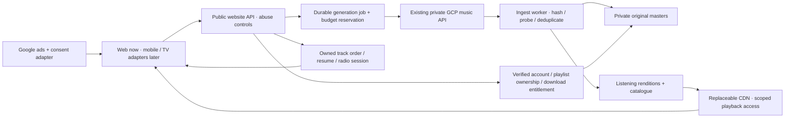

# Standards ledger

⚠️ UNVERIFIED RELAY — DO NOT CITE

Status: BOUNDED RECOMMENDATION ISSUED; full research-standard closure remains OPEN. This required banner concerns the unclosed independent-source floor and relayed supplemental evidence; directly checked primary product facts and hypothetical arithmetic are identified below. Cite the controlling primaries, not this report as an independent authority. Five academic works were fully read by the assigned researcher; the investigation does not establish twenty independent authority families or three-way independent corroboration of vendor-specific facts. It makes no exhaustive-research or production-readiness claim.

Owner decision: cloud provider is UNDECIDED. This report serves the explicit request to research AWS and Google Cloud and recommend, not to deploy. Research follows the project law and installed deep-research covenant (SHA-256 F19F5CB14319E09EC73FDF42FEEF2D3067EC8A5949A34657ED9E5C1104D5F9EB). Exact scopes, contradictions and gaps are in the [source ledger](2026-09-12-audio-cloud-source-ledger.md) and [audit manifest](_runs/2026-09-12-audio-cloud-platform-decision.json). Older reports are context, not fresh measurement.

# Recommendation — proposed, not selected by Berk

**Start with a Google Cloud core and provider-independent playback delivery. Keep the working music-generation API in place; use owner-controlled Cloud Storage for durable assets, a separate website backend and ingestion workers, and a CDN for listening. For the initial product, recommend a personalized server-owned listening queue with Google IMA audio breaks. Evaluate AWS S3 + CloudFront as the first delivery alternative when actual traffic or existing-resource verification justifies the extra cloud boundary.**

This recommendation is an engineering judgment about this product's current starting point. It is not a claim that Google has inherently better audio, security, graphics or advertising demand. The strongest counterargument is AWS's flat CDN pricing: a sufficiently busy music service can save material delivery cost. If verified reusable AWS infrastructure and that saving exceed the additional operating cost, choose the hybrid delivery path from the start. No vendor choice, purchase, deployment, IAM change or website rewrite has been executed.

Do not migrate the existing generation engine merely to make the cloud diagram uniform. Conversely, do not require two clouds only because an older research lane was AWS-specific. Historical AWS media/auth resources are not a fresh inventory or a confirmed migration burden.

## First define what radio means for this product

A personalized listening session can own track order, recommendation, resume, skipping and between-track ads while sending immutable audio files/segments through a CDN. It does not need a continuously running encoder per listener. This matches the generated catalogue and accepted interactive player.

A synchronized linear station has one shared clock. During a personalized ad, that station continues advancing: a naive pause/resume skips content or creates growing delay. It therefore needs reserved break windows, explicit delay/resynchronization semantics, or an appropriately stitched session. This is a distinct optional broadcast service, not a requirement inferred from the word “radio.”

Google's current HTML5 IMA guide provides a real audio-only client integration. It works independently of where the content is hosted; publisher inventory and consent remain prerequisites. Audio ad controls, user activation and correct next-track recovery must be implemented, not simulated. [Google IMA audio guide](https://developers.google.com/interactive-media-ads/docs/sdks/html5/client-side/audio)

## Comparable options

| Requirement | Google Cloud core + owned playback | AWS listening layer + existing GCP engine | Decision implication |
| --- | --- | --- | --- |
| Durable generated assets | Private Cloud Storage; ingest and verify before publishing | Private S3; ingest once across clouds, then serve owned copies | Both satisfy “our server”; upstream temporary URLs must not remain the listening origin |
| Personalized music/radio | Our queue/session service + CDN + IMA | Same product service + CloudFront + IMA | No managed broadcast vendor is mandatory |
| Managed audio packaging | Transcoder documents audio-only HLS | MediaConvert audio-only flow appears in AWS's audio tutorial | Preserve compatible delivered encodings; don't re-encode every request |
| Managed server ad stitching | Video Stitcher documented for video; pure-audio eligibility not established | MediaTailor has an explicit audio-only integration example | AWS stronger evidence when managed audio SSAI is actually required |
| Synchronized scheduled channels | Owned scheduler/playout or a separately validated service | MediaTailor Channel Assembly has a VOD scheduling service | Pure-audio end-to-end channel proof still required; product name is not a test |
| Global media delivery | Cloud CDN; Media CDN is a separate sales-enabled offering | CloudFront PAYG or eligible flat plan | Model destination, requests and cacheability, not just stored GB |
| Google ads | Separate publisher/SDK/consent integration | The same separate integration | Hosting buys neither ad approval nor fill |
| Security/access | Private origin, scoped signed delivery, backend ownership | Private S3 with OAC, scoped signed delivery, backend ownership | Configuration and negative tests decide protection |
| Mobile/tablet/TV | Shared backend plus platform media/ad/UI adapters | Same requirement | Neither cloud ships the device clients |
| Operations | Fewer cloud identity, copy and incident boundaries if core stays here | Extra boundary; possibly worthwhile if reusable AWS services are verified | Measure actual operations cost before making savings claims |

Primary feature evidence: [GCP audio-only configuration](https://docs.cloud.google.com/transcoder/docs/concepts/config-examples), [AWS audio-only MediaTailor example](https://aws.amazon.com/blogs/media/monetize-audio-only-content-with-aws-elemental-mediatailor/), [Channel Assembly guide](https://docs.aws.amazon.com/mediatailor/latest/ug/channel-assembly-getting-started.html), [Video Stitcher overview](https://docs.cloud.google.com/video-stitcher/docs/concepts/overview), [Media CDN overview](https://docs.cloud.google.com/media-cdn/docs/overview). These are single-source official product facts, not independent measured comparisons. AWS's example dates to 2022 and is not current account readiness. Google audio tracks inside video are not proof of a pure-audio stitching contract.

## Proposed application and media boundaries

The browser receives no upstream API key, Google service identity token or long-lived master credential. Upstream delivery leases are consumed by the ingestion worker. An interrupted copy resumes or renews delivery access without submitting a new paid generation. Original takes, duration, codec, checksum and provenance remain attached to a stable track identity.

Separate publication states: generated, ingesting, validated, playable, failed/retryable. Publish only validated objects and complete manifests. The database, durable jobs and object keys must agree before the UI says “ready.” Retain the original master; create lower-bandwidth listening variants only when needed. Packaging latency must be measured: Transcoder's asynchronous processing documentation does not promise an interactive deadline. [Transcoder overview](https://docs.cloud.google.com/transcoder/docs/concepts/overview)

For portability, define storage, packaging, playback signing, identity and ad-entitlement interfaces; keep content IDs independent of bucket hostnames. If AWS delivery wins later, copy immutable renditions to S3, verify hashes, shadow-check playback, shift new sessions and retain rollback. Avoid continuously filling CloudFront directly from cross-cloud masters without pricing cache misses and securing that origin.

## Cost: dated sensitivity, not a forecast or full bill

All figures are USD public list-price arithmetic accessed on 2026-09-12. The scenario assumes **192 kbps payload**, 6-second HLS segments, 3-minute tracks, two manifest requests per track, Europe delivery and 5% intra-Europe cache fill. It excludes transport/container overhead, skips, retries, rendition switches, ads, auth/API/site traffic and uncached personalized responses.

A listener-hour transfers 86.4 MB decimal = 0.080466 GiB. The personalized VOD scenario makes about 640 media requests/hour. A synchronized live stream reloading a playlist every 6 seconds makes about 1,200; a 3-second reload sensitivity makes 1,800. These are workload assumptions, not traffic measurements or mandated segment settings.

| Monthly listening hours | Payload / VOD media requests | CloudFront PAYG sensitivity | Google Cloud CDN component | AWS flat plan candidate |
| --- | --- | --- | --- | --- |
| 10,000 | 0.864 TB / 6.4 million | $0 with the assumed unused shared free allowance | $70 | PAYG may fit this small component; security/other services extra |
| 100,000 | 8.64 TB / 64 million | $662–714 | $696 | Business $200, 50 TB / 125 million requests |
| 1,000,000 | 86.4 TB / 640 million | $6,572–6,905 | $5,202 | Premium expansion $2,250, 125 TB / 1.25 billion requests |

**The last column is a real AWS advantage, not the website's total monthly price.** At 100,000 hours it is roughly $496 below the illustrative standalone Google CDN component before differences in inclusions and other charges. At one million hours the component difference is about $2,952. These amounts can reverse the preferred delivery provider; they do not establish the cost of running the product.

AWS's GB/TB unit interpretation was not conclusively established in the CloudFront sources, so the PAYG column deliberately shows decimal/binary sensitivity. Google explicitly bills GiB. AWS's shared free allowance is assumed unused; another distribution can consume it. The table must not be represented as a quote. [CloudFront PAYG rates](https://aws.amazon.com/cloudfront/pricing/pay-as-you-go/), [Cloud CDN pricing](https://cloud.google.com/cdn/pricing)

Flat-plan eligibility, distribution features, request limits and sustained over-allowance delivery behavior need confirmation. “No overage charge” is not an unlimited performance promise. At 100,000 live hours, 120 million media requests leaves little room under Business's 125 million; 180 million exceeds it. The personalized VOD scenario has much better headroom. Pro supports OAC and managed caching; Business is not an invented security minimum. [CloudFront flat plans](https://aws.amazon.com/cloudfront/pricing/), [plan documentation](https://docs.aws.amazon.com/AmazonCloudFront/latest/DeveloperGuide/flat-rate-pricing-plan.html)

Google's Global Front End Enterprise is a **Preview, account-allowlisted consolidated metered tariff**, not a comparable flat cap. Its EU example for this 100,000-hour VOD scenario is about $976 with one forwarding rule at 730 hours, including a different service bundle. It is not the default launch dependency. Media CDN requires a separate commercial evaluation rather than substituting Cloud CDN prices. [Global Front End pricing](https://cloud.google.com/vpc/network-pricing), [availability](https://docs.cloud.google.com/docs/networking/cross-cloud-network/global-front-end/gfee-manage)

Other cost boundaries:

- Storage, database, backups, compute, job orchestration, identity, logs, load balancing, security services, support and taxes remain additional or plan-dependent. Generation is the same upstream cost in both alternatives.
- An illustrative 10,000 three-minute stereo 48 kHz/24-bit PCM masters is 482.8 GiB. At the applicable $0.12/GiB example tariff, copying that payload out of GCS is about $58 **once**, not on every listen. Actual compressed files, region and discounts change it. [Storage pricing](https://cloud.google.com/storage/pricing)
- At $0.005 per output minute, 30,000 source minutes into three audio-only renditions would cost $450 through GCP Transcoder. This is unnecessary if suitable delivered renditions can be reused. [Transcoder prices](https://cloud.google.com/transcoder/pricing)
- MediaTailor live insertion is $0.50 per 1,000 insertions; VOD is $0.25. Four live ads per listener-hour would add $200 at 100,000 hours, before other media charges. This is a sensitivity, not our chosen cadence or an ad-fill estimate; client IMA does not inherently incur this service fee. MediaTailor-specific delivery charges must not be erased by broad CDN origin-waiver language. [AWS's revised ad pricing](https://aws.amazon.com/about-aws/whats-new/2025/04/new-aws-elemental-mediatailor-pricing-model/)

The machine-readable [cost model](_sources/2026-09-12-audio-cloud-cost-model.json) contains all three request modes, units, assumptions, exclusions and formulas. No revenue or profit claim is possible without actual listening distribution, generation usage, ad fill and realized yield.

## Access and security

| Action | User access | Server enforcement |
| --- | --- | --- |
| Listen / create | Guest permitted | Durable anonymous session, rate and concurrency limits, account-wide spend reservation, idempotent admission; IP alone is insufficient |
| Save or edit playlist | Login required | Verified account session and object-level ownership on every read/write |
| Official master download | Login plus eligible rewarded action required | Exact benefit bound to account/track, recorded evidence type, one entitlement, limited master delivery access |
| Media ingestion / upstream API | Workers only | Separate identities, least privilege, secret isolation, time/size/redirect limits, validation and controlled publication |

Signed URLs control access for whoever possesses them; they are not account identity. Cloud CDN does not universally reject unsigned requests by itself: the private origin must close that path. GCS public access removal and signed/unsigned cache behavior need negative tests. Existing organization restrictions may also require an allowed CDN service identity. [Cloud CDN signed access](https://docs.cloud.google.com/cdn/docs/using-signed-urls)

On AWS, use a private S3 bucket origin and correctly scoped OAC; an S3 website endpoint is not equivalent. Viewer authorization and origin authorization remain distinct. [CloudFront OAC](https://docs.aws.amazon.com/AmazonCloudFront/latest/DeveloperGuide/private-content-restricting-access-to-s3.html)

Keep the music-generation API private. A separate public guest website backend needs an organization-approved ingress design. GCP documents a public-service mode without an allUsers binding, but an organization can prohibit it; this project's effective constraints were not audited here and no policy is being weakened. [Cloud Run public access](https://docs.cloud.google.com/run/docs/authenticating/public)

Additional proposed controls: secure HttpOnly account cookies and CSRF defense; OAuth code/PKCE/issuer/audience validation; durable job uniqueness and global budget ceilings; quarantine unknown media; no open URL-fetch proxy; immutable audit events with redacted credentials; deletion/retention rules; tested backup restoration; alerts for spending and playback failure. These are implementation requirements, not claims of delivered security.

A listener can capture playable audio. Protect the official high-quality export and account/library benefits without promising that streaming bytes cannot be copied. DRM, if later justified, requires per-platform codec/license/latency and economic analysis; it is not automatically solved by either bucket vendor.

## Google ads and rewarded downloads: separate release dependencies

Google's reward policy restricts the nature and transferability of benefits. It does not explicitly approve this project's portable MP3/WAV export. Obtain product-specific classification of the exact reward and rights before treating that model as eligible. This is an unresolved application of the policy, not a claimed official ban or permission. Do not silently replace Berk's requested download with generation credits. [Reward policy](https://support.google.com/admanager/answer/7496282?hl=en)

Google explicitly states that **server-side verification is available for apps, not rewarded web**. A browser grant event, login, timer or nonce cannot become a Google-signed completion proof. Native AdMob has a separate signed callback mechanism. The web benefit requires an explicitly accepted evidence/fraud model or a different verified provider/flow, while preserving the owner's requested benefit for decision. [Rewarded web](https://support.google.com/admanager/answer/9116812?hl=en), [native SSV](https://developers.google.com/admob/android/ssv)

Audio inventory, approved demand, real ad units and consent configuration are unverified. A discreet banner needs reserved space away from prompt/player controls; no-fill must not leave a misleading fake ad. Both clouds require the same publisher setup. The present research created no ad requests, impressions or account settings.

## Universal product, separate platform proof

Share catalogue, session, playlist, entitlement and generation contracts. Use capability-based media, ad, consent and rendering adapters for web, native Android/iOS and TV. Provide touch, keyboard and remote focus rules; scale the existing Three.js effects to measured device capability. Cloud hosting does not make an older TV GPU or browser support a shader, codec or ad SDK.

Google's additional-platform page directs Samsung/LG integrations to an account manager and expressly does not promise official IMA support for those examples. Native background audio and TV model/year testing are distinct from a successful desktop web preview. [IMA additional platforms](https://developers.google.com/interactive-media-ads/docs/sdks/other)

The [five-paper academic slice](2026-09-12-audio-cloud-qoe-evidence.md) informs startup, buffering, browsing, ad-load and listener-retention measurements. Its experiments differ in date, population and method; some quality labels are model-derived. It does not rank cloud vendors or justify a universal bitrate, MOS formula or advertisement frequency. The [owned-radio comparison](2026-09-12-owned-radio-alternative.md) records playout, packaging, player, licensing and release boundaries; no optional component is selected merely by appearing in that report.

## Decision changes and required proof

Choose AWS delivery earlier if an actual quote/eligible flat plan, verified reusable AWS resources and operational ownership make its saving meaningful. Prefer AWS managed media investigation if synchronized scheduled audio with server stitching becomes an explicit first-release requirement. Keep GCP-first if the simpler operating boundary wins and measured delivery cost/quality fits the budget. A sales-enabled Media CDN offer can also change this conclusion.

Before production readiness, verify a small end-to-end pilot using owned audio: generation → copy integrity → publication → guest playback → correct next-track ad/no-fill recovery; unauthorized playlist/master rejection; idempotent job recovery; valid account sessions; actual reward evidence if eligible. Test cold/warm playback, interruptions, expiry during a track, seeking, prolonged listening, corruption, worker restart and origin failure. Instrument first audible sample, stalls, track/ad transition gaps, errors and cost per listener-hour. Set target SLOs from measured device/network evidence and product expectations, not invented performance measurements.

No production pilot, target-device compatibility run, publisher approval, commercial quote, fresh AWS inventory or complete website integration is claimed here. Provider-dependent implementation remains pending Berk's decision. The current recommendation is reviewable; the full research-standard closeout and external release gates are tracked separately in the source ledger and run manifest.

Recorded scope, owner requirements and research ownership

# Scope plan / decision served

Choose a defensible platform direction for PlayMusicPrompts owned music storage, on-demand audio and scheduled radio, with Google audio between tracks, discreet web banners and login-plus-rewarded download. Music generation already runs on private Google Cloud Run; authenticated free health/capabilities were measured this session. Existing AWS media/auth resources are historical project evidence and do not make AWS the selected provider. Web is the current implementation scope; iOS/Android phone/tablet and Samsung/LG/other TV clients must inform shared interfaces.

Compare: GCP-first (Cloud Storage, Cloud Run/workers, CDN, audio packaging, ad insertion), AWS listening layer (S3, compute/workers, CloudFront, MediaConvert/MediaTailor) while retaining the existing generation API, and explicit hybrid alternatives. Questions: actual audio-only support; ingest and integrity; master/rendition isolation; latency and buffering; radio scheduling; client versus server ad insertion; Google demand/consent/reward eligibility; IAM/guest/account abuse controls; platform playback/DRM boundaries; operations, portability, observability; dated pricing and workload-sensitive costs.

Falsifiers: unsupported audio-only SSAI or channel assembly; unacceptable measured first-play/transition behavior; absent publisher demand; incompatible export reward policy; lack of server-verifiable web rewards; commercial CDN pricing/availability; actual egress/request costs reversing the recommendation. Do not infer feasibility from video-only examples or latency from marketing. No absolute copy-prevention guarantee. Do not equate responsive web with shipped native/TV applications.

Global audience; current 2026 official product evidence first, controlling standards and relevant academic lineage second. Include AWS/Google primary docs/pricing/APIs, IAB/Google advertising policy, actual SDK/device support, independent QoE/advertising research and relevant maintained first-party/open-source implementations. Exclude unverified price aggregators, vendor feature counts as proof of quality, irrelevant SsmContentAssetCreator platform decisions, invented usage/revenue forecasts and unauthorized cloud/ad/identity changes. Broader vendors may serve as alternatives or falsifiers without an unapproved purchase.

Planned canonical artifacts (6): this decision report; `2026-09-12-audio-cloud-source-ledger.md` (queries, sources, claims, contradictions, preservation, delegation and application); `2026-09-12-audio-cloud-qoe-evidence.md` (academic slice); `_runs/2026-09-12-audio-cloud-platform-decision.json` (honest audit manifest); `_sources/2026-09-12-audio-cloud-cost-model.json` (reproducible assumptions/calculations). The sixth artifact is `2026-09-12-owned-radio-alternative.md` (provider-neutral playout alternatives). Existing bounded slices remain in `docs/implementation/2026-09-12-website-api/ads-auth-platforms.md` and `streaming-architecture.md`. Source captures/metadata are annexes recorded in the final manifest. Append an entry to the existing research index. No completed/exhaustive claim until relevant coverage, full-reading, source/claim gates and arithmetic/source review pass; test-only/provider-account gates remain explicit.

# Owner requirements and precedence

- Preserve all three accepted `website_html_templates*` trees and English product experience.
- Own controlled music storage and playback/radio after generation.
- Guests can listen and generate; playlists and downloads require login; download additionally rewarded ad.
- Google audio between tracks, unobtrusive banner.
- Web now; universal architecture for future TV, phone and tablet applications.
- Security high priority. Provider recommendation first, owner selection pending.
- Earlier AWS-only search scope and older reward-for-generation decision are superseded by current instruction; preserve their history rather than silently reusing them.

# Research lanes and verification

Parent: price/operations/security comparison, primary re-verification, unit-correct cost model and synthesis. `streaming_architecture`: actual AWS/GCP audio packaging/radio/SSAI and platform-neutral media contract. `website_client_audit`: current Google audio/banner/reward policy and platform trust boundaries. `api_contract`: five relevant full academic primaries on audio/listener QoE, adaptation/ad cadence with applied depth records. Bounded writes; all workers received quality-before-speed, current goal, constraints, exact outputs and parent verification duties. No source relay alone is verified evidence.

